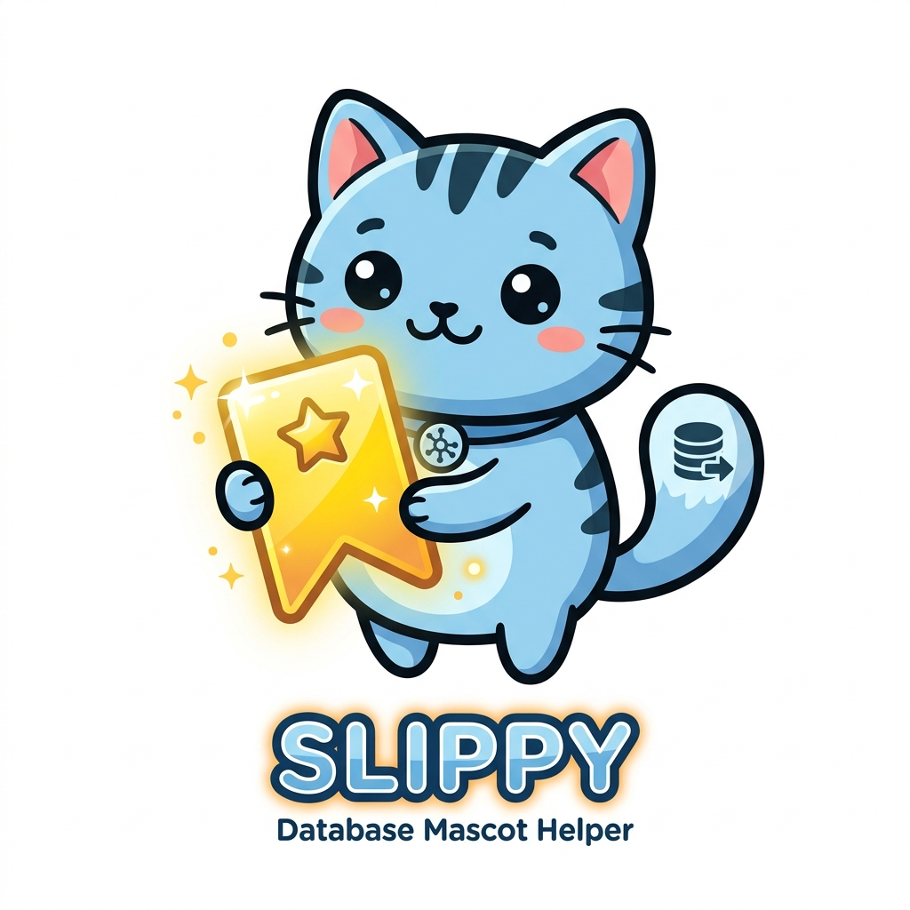
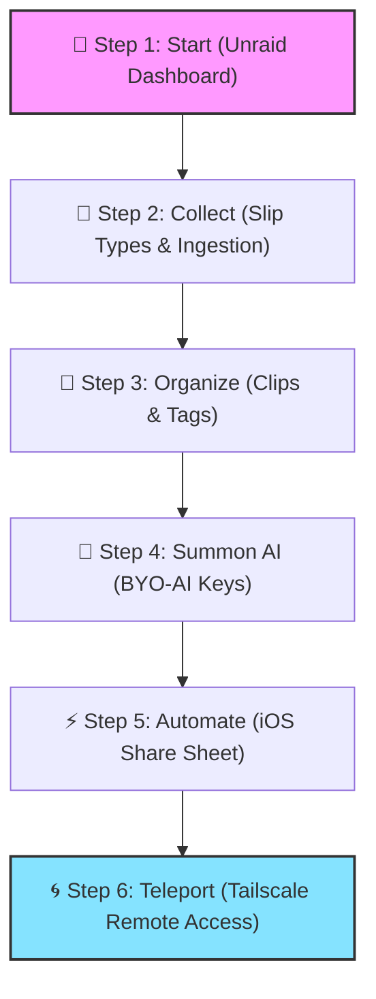
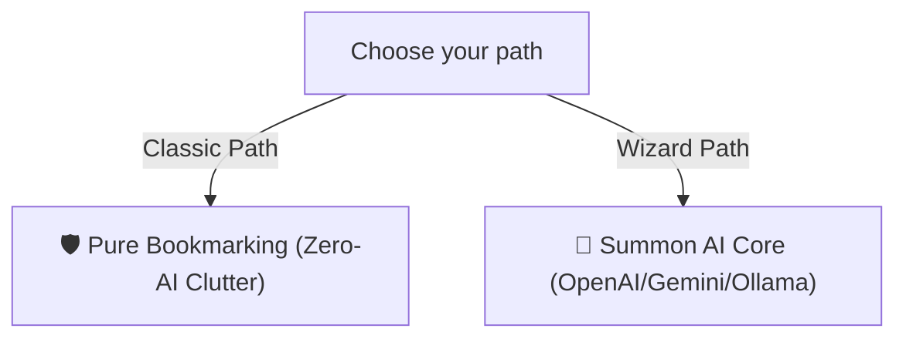
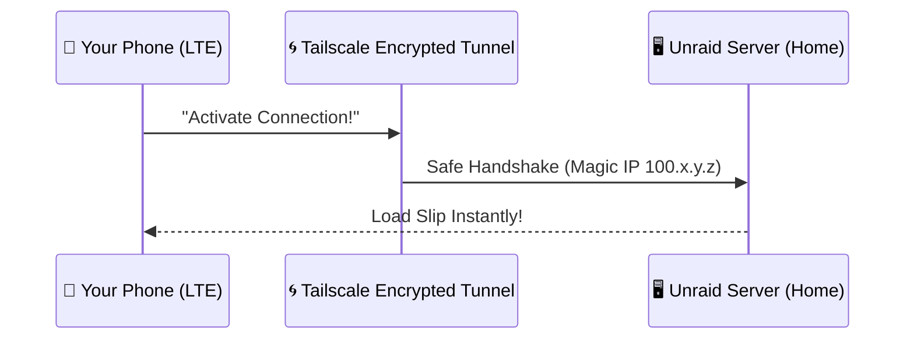

# 🔖 SLIP: The Visual Archiving Chronicles
*A Guided Visual Quest with Slippy, your Server Companion.*

---

## 🗺️ Meet Your Guide



💬 **Slippy**: *"Hi! I'm Slippy, your local database companion! Let's get Slip set up on your Unraid server."*

---

## 🗺️ The Map of Your Journey



---

## 🎮 QUEST 1: Awakening the Server
*Objective: Install and understand what you just launched on Unraid.*

💬 **Slippy**: *"Behold! You've successfully summoned Slip onto your Unraid array! You can install me in 1-click directly from the Unraid **Apps** tab by searching for **Slip**. I've set up shop inside a tiny Alpine container running on port 3000. All your saved bookmarks, cache images, and databases are stored safely under your server's `/config` directory."*

```text
📋 QUEST LOG:
[✓] Install in 1-Click via Unraid Community Applications (Apps tab)
[✓] Summon container on Port 3000
[✓] Establish persistent vault in /mnt/user/appdata/slip
```

> [!NOTE]
> **Slippy's Safety Guard**: I use your Unraid `PUID` and `PGID` settings to make sure I don't write files with root permissions, so you never get those annoying permission locks on your shares!

---

## 💎 QUEST 2: Discovering the Types of Slips (Your Inventory)
*Objective: Learn about the different items you can collect and how they ingest.*

💬 **Slippy**: *"Let's take a look at what kinds of loot you can store in your vault. When you feed me a link or write a note, I dynamically analyze and classify it into one of these types:"*

* **📖 Articles**: If you save a written article (like a blog or news page), I extract the readable text and clean up ads/trackers. You can open them in our distraction-free **Reader Mode**, change typography, and highlight key sentences.
* **🎥 Videos**: Paste a YouTube, Vimeo, or video link, and I will create an embed player directly on the card so you can watch it without leaving your feed.
* **🛍️ Products**: Save a store page (Amazon, Shopify, etc.), and I'll extract product images, descriptions, and help you keep track of your shopping lists.
* **🖼️ Images**: Drag in or paste direct image URLs, and I'll display them in a high-density visual gallery masonry grid.
* **🌐 Websites**: For generic links, I'll grab OpenGraph metadata (title, description, cover image) and automatically fall back to full-page screenshots if firewalls block access.
* **📝 Notes**: Write your own private thoughts in Markdown. Click the **Note icon** on any card or create standalone notes. These are indexed by FTS5, so they show up in your searches!

💬 **Slippy**: *"How do we get these items into our collection? You have three main portals:"*
1. **The Ingestion Bar**: Paste any link or type a quick note directly at the top of your dashboard.
2. **Bulk Import**: Go to **Settings ➔ Import/Export** to upload a standard Netscape HTML file from Chrome, Safari, or Raindrop. I will import all your bookmarks in bulk!
3. **External Portals**: Use our desktop browser extension or iOS Share sheet shortcut.

---

## 🤖 QUEST 3: Summoning the AI Core (BYO-AI)
*Objective: Decide whether to play as a Classic Archiver or an AI Wizard.*

💬 **Slippy**: *"Here is where you make a choice. You can play Slip in two modes. I will adapt to whatever you choose!"*



💬 **Slippy**: *"If you want the AI Wizard path, bring me your API keys from **OpenAI**, **Claude**, **Gemini**, or even a local **Ollama** server. Go to **Settings ➔ AI Configuration**, paste the key, and click Save. I'll encrypt it instantly with AES-256."*

💬 **Slippy**: *"Once connected, I will automatically read your articles to tags, summarize notes, and let you search using conceptual thoughts instead of exact words!"*

> [!TIP]
> **Slippy's Promise**: Don't want AI? No problem. I'll hide all AI buttons, settings, and badges so they don't get in your way. No clutter, just fast bookmarking!

---

## 📂 QUEST 4: Sorting the Loot (Clips & Tags)
*Objective: Organize your visual cards without making a mess.*

💬 **Slippy**: *"Look at your dashboard! You can save articles, videos, design graphics, and products. Let's keep them tidy."*

💬 **Slippy**: *"You have two tools in your inventory:"*

* **🏷️ Tags**: Flat, quick labels like `#inspiration` or `#development`. Tap them on any card to instantly filter your view.
* **📁 Clips**: Think of these as secret compartments. You can nest them (e.g. `Hobbies` ➔ `3D Printing`). 

> [!IMPORTANT]
> **Slippy's Organizing Trick**: Unlike standard folders that crowd your view, Clips are **hidden by default**. Your dashboard stays clean. You can "pin" your favorite Clips to the sidebar to jump to them quickly!

---

## ♻️ QUEST 5: The Recycle Shield (How Deletions Work)
*Objective: Salvage items from accidental destruction.*

💬 **Slippy**: *"Whoops! Clicked delete on that recipe card by accident? Don't panic, I have deployed the **Recycle Shield**!"*

```text
[ Card Deleted! ] ───(6-Second Warp)───> [ Undo Toast ] ──(Click)──> [ Restored! ]
                                             │ (Time Expires)
                                             ▼
                                     [ Recycle Clip ]
```

💬 **Slippy**: *"When you click delete, I hold the card in mid-air for **6 seconds**. You'll see a floating banner at the bottom. Tap **Undo** to bring it back instantly."*

💬 **Slippy**: *"If you let the timer run out, the card goes to the **Recycle Clip**. It's not gone! You can open the Recycle Clip from the menu to restore it. If you want to permanently purge it, click **Empty Recycle Clip** to free up server space."*

---

## 🌀 QUEST 6: The Teleportation Portal (Access Slip Anywhere)
*Objective: Connect to your home server securely from anywhere in the world.*

💬 **Slippy**: *"So, you're at a coffee shop and want to view your bookmarks? Normally, your Unraid server is locked inside your home network. But we can build a secure teleportation tunnel using **Tailscale**!"*



💬 **Slippy**: *"No port forwarding. No firewall holes. Here is the ritual:"*

1. **Install Tailscale on Unraid**: Go to your Unraid **Apps** tab, search for **Tailscale**, and install it. Log in to register your server.
2. **Find your Magic IP**: Look at your Tailscale dashboard. Your server will get a new IP address starting with `100.x.y.z`.
3. **Install on your Phone**: Get the Tailscale app on your phone or laptop and log in. Turn it ON.
4. **Access Slip**: Open your browser on the road and type `http://100.x.y.z:3000`. You are in!

---

## 📱 QUEST 7: The 1-Second Capture (iOS Share Sheet)
*Objective: Save links directly from Safari in under a second.*

💬 **Slippy**: *"Now, let's connect your phone's share button directly to my server!"*

💬 **Slippy**: *"Go to **Settings ➔ API Keys** on your Slip dashboard, generate a new key, and copy the code. Then, create an iOS Shortcut like this:"*

```ini
[POST] http://100.x.y.z:3000/api/bookmarks
├── Headers:
│   ├── Authorization: Bearer YOUR_API_KEY
│   └── Content-Type: application/json
└── JSON Body:
    └── url: [Safari Webpage URL]
```

💬 **Slippy**: *"Enable 'Show in Share Sheet'. Now, whenever you are reading a cool article on Safari, just tap Share ➔ Save to Slip. I will catch the link and archive it in under a second!"*
