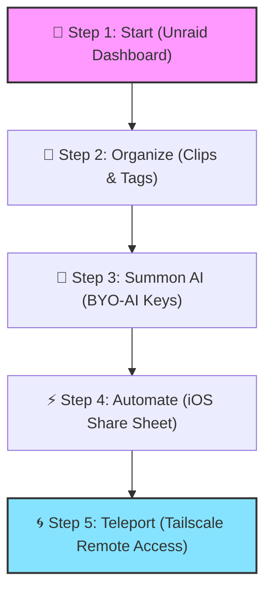
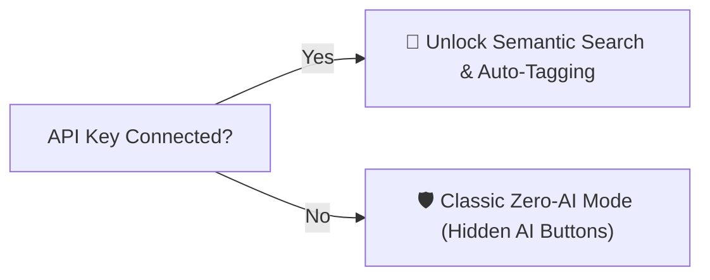
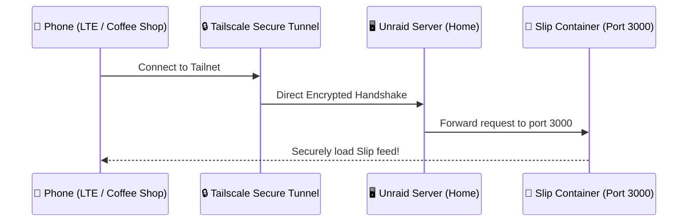

# 🔖 SLIP: A Self-Hosted Visual Quest
*A Visual Guide to Archiving, Reading, and Teleporting Your Bookmarks.*

---

## 🗺️ The Map of Your Journey



---

## 📖 Chapter 1: The Quest Board (Core Concepts)

```markdown
### 🎨 1. What is Slip?
Imagine a clean, high-density masonry grid of cards representing everything you want to remember. 
No ugly blue links. Slip saves visual previews, extracts readable text, and takes automated screenshots of articles, products, and notes.

> [!NOTE]
> All files, caches, and the database live entirely on your hardware.

### 📁 2. Clips vs. Tags
* **Tags** (`#inspiration`, `#dev`): Fast, lightweight labels for filtering the main stream.
* **Clips** (Folders): Hierarchical structures that let you nest collections (e.g. `Hobbies` ➔ `3D Printing`). 

> [!TIP]
> Clips are hidden by default to keep your interface clean and zen-like. Pin your favorites to the sidebar for easy access!

### ♻️ 3. The Recycle Shield (Soft Delete)
Deleting a card moves it to the Recycle Clip (Soft Delete). 
* **6-Second Time Warp**: When you delete a card, a toast banner pops up. You have 6 seconds to click Undo to instantly restore it.
* **Cascade Choice**: Deleting a parent folder gives you the option to Promote nested items up a level, or Cascade delete the whole family.

### 🔌 4. Integrations & Portals
* **Browser Extension**: Capture pages in 1 click using Cmd+Shift+S.
* **iOS Shortcut**: Post links straight from Safari's Share Sheet in under a second using your generated API key.
```

---

## 🤖 Chapter 2: Summoning the AI Companion (BYO-AI)

Slip comes with a **Bring Your Own AI (BYO-AI)** engine. If you connect an LLM, you unlock advanced semantic search and automated tagging. If you don't, the app morphs into a clean, traditional bookmark archiver with zero AI clutter.



> [!IMPORTANT]
> **To summon your AI helper:**
> 1. Go to **Settings** ➔ **AI Configuration**.
> 2. Paste your API key from **OpenAI**, **Anthropic**, **Gemini**, or configure a local **Ollama** server.
> 3. Click **Test & Save**. (All keys are encrypted in your SQLite database using AES-256).

---

## 🌀 Chapter 3: Teleporting Your Access (Tailscale Anywhere)

Because Slip runs on your local Unraid server, it is normally locked to your home network. Instead of opening ports on your router (which exposes your server to hackers), we will create a secure **encrypted portal** using **Tailscale** to access Slip from your phone anywhere in the world.

### The Secure Connection Path:


### 🛠️ Quick Portal Setup:

> [!TIP]
> **Step 1: Install Tailscale on Unraid**
> * Go to the **Apps** tab on your Unraid server.
> * Search for **Tailscale** and click **Install**.
> * Open the Tailscale configuration page and log in to link your server to your Tailscale network (your "Tailnet").
> 
> **Step 2: Get your Server's Magic IP**
> * Look at your Tailscale admin console. You will see a unique IP assigned to your Unraid server (it will start with `100.x.y.z`). This is your server's permanent, private address.
> 
> **Step 3: Connect your Phone or Laptop**
> * Download the Tailscale app on your iPhone, Android, or laptop.
> * Log in with the same account.
> * Turn Tailscale **ON**.
> 
> **Step 4: Load Slip Anywhere**
> * In your browser or iOS shortcut, use your Tailscale IP instead of your local network IP:
>   `http://100.x.y.z:3000`
> * You can now search, save, and read bookmarks securely from any cellular network or hotel Wi-Fi in the world!

---

## 📱 Chapter 4: The 1-Second Capture (iOS Share Sheet)

Configure your phone to save bookmarks in one tap:

1. Open **Shortcuts** on your iOS device and create a new shortcut named **Save to Slip**.
2. Set it to **Receive URLs** from the Share Sheet.
3. Configure a **"Get Contents of URL"** block as follows:

```ini
[POST] http://100.x.y.z:3000/api/bookmarks
├── Headers:
│   ├── Authorization: Bearer YOUR_API_TOKEN
│   └── Content-Type: application/json
└── JSON Body:
    └── url: [Shortcut Input]
```

4. Toggle **"Show in Share Sheet"** in the shortcut's details panel.

Now, simply share any Safari link, select **Save to Slip**, and teleport your bookmark home!
