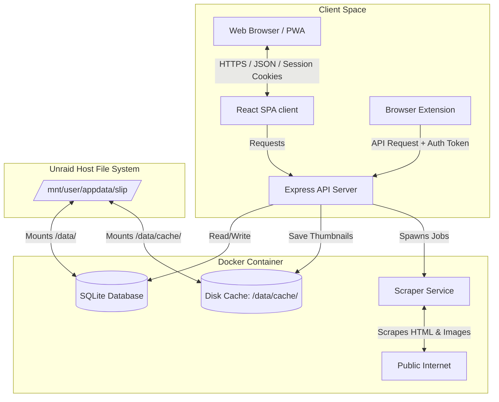
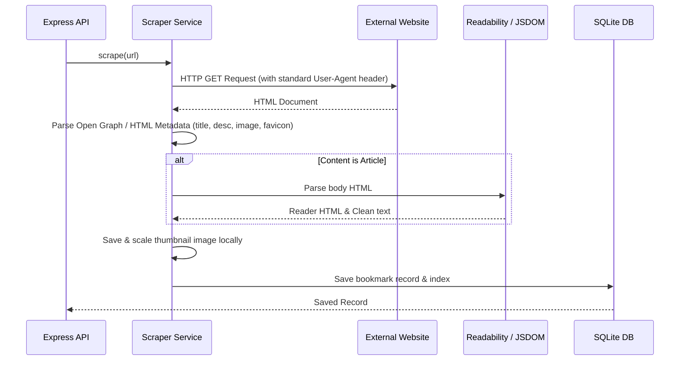

# Architecture & System Design Document: Slip

This document outlines the technical design, system topology, database schemas, API specifications, and Docker/Unraid hosting configuration for **Slip**, a self-hosted visual bookmarking app.

---

## 1. System Topology & Tech Stack



### 1.1. Technology Stack Selection
*   **Frontend**: React (Vite, TypeScript) for a fast, responsive Single Page Application (SPA).
*   **Styling**: Modern, responsive Vanilla CSS (custom properties, flexbox, grid, masonry utility).
*   **Backend**: Node.js with Express and TypeScript.
*   **Database**: SQLite via the `better-sqlite3` driver. This provides zero-config, highly-performant local SQL queries with a tiny CPU/RAM memory footprint.
*   **Scraper Engine**: `axios` for fetching pages, `cheerio` for parsing metadata, and `@mozilla/readability` combined with `jsdom` to clean up article bodies.
*   **Sanitization**: `dompurify` (for backend/frontend sanitization of scraped HTML content).

---

### 2. Database Schema

The database schema leverages relations for users, bookmarks, tags, and includes shareable lookup tokens. It employs an FTS5 virtual table in SQLite for fast search matching across all collections.

```mermaid
erDiagram
    USERS ||--o{ BOOKMARKS : owns
    BOOKMARKS ||--o{ BOOKMARK_TAGS : categorizes
    TAGS ||--o{ BOOKMARK_TAGS : defines
    BOOKMARKS ||--o{ SHARED_LINKS : creates
    TAGS ||--o{ SHARED_TAGS : creates
    USERS ||--o{ API_KEYS : generates

    USERS {
        INTEGER id PK
        TEXT username UNIQUE
        TEXT password_hash
        TEXT created_at
    }

    BOOKMARKS {
        INTEGER id PK
        INTEGER user_id FK
        TEXT url
        TEXT title
        TEXT description
        TEXT content_type
        TEXT reader_html
        TEXT raw_text
        TEXT image_path
        TEXT favicon_path
        TEXT created_at
        TEXT updated_at
    }

    TAGS {
        INTEGER id PK
        TEXT name UNIQUE
        TEXT created_at
    }

    BOOKMARK_TAGS {
        INTEGER bookmark_id FK
        INTEGER tag_id FK
    }

    SHARED_LINKS {
        TEXT token PK
        INTEGER bookmark_id FK
        INTEGER user_id FK
        TEXT created_at
    }

    SHARED_TAGS {
        TEXT token PK
        INTEGER tag_id FK
        INTEGER user_id FK
        TEXT created_at
    }

    API_KEYS {
        INTEGER id PK
        INTEGER user_id FK
        TEXT token_hash UNIQUE
        TEXT name
        TEXT created_at
    }
```

### 2.1. Table Definitions (DDL)

```sql
-- Users Table
CREATE TABLE users (
    id INTEGER PRIMARY KEY AUTOINCREMENT,
    username TEXT UNIQUE NOT NULL,
    password_hash TEXT NOT NULL,
    created_at TEXT DEFAULT (datetime('now'))
);

-- Bookmarks Table
CREATE TABLE bookmarks (
    id INTEGER PRIMARY KEY AUTOINCREMENT,
    user_id INTEGER NOT NULL,
    url TEXT NOT NULL,
    title TEXT NOT NULL,
    description TEXT,
    content_type TEXT DEFAULT 'website', -- 'article', 'product', 'video', 'image', 'website'
    reader_html TEXT,                     -- Cleaned text reader HTML
    raw_text TEXT,                        -- Extracted plaintext for search index
    image_path TEXT,                      -- Local filename for cache thumbnail
    favicon_path TEXT,                    -- Local filename for cache favicon
    created_at TEXT DEFAULT (datetime('now')),
    updated_at TEXT DEFAULT (datetime('now')),
    FOREIGN KEY(user_id) REFERENCES users(id) ON DELETE CASCADE
);

-- Create index on user_id and url
CREATE INDEX idx_bookmarks_user ON bookmarks(user_id);
CREATE INDEX idx_bookmarks_url ON bookmarks(user_id, url);

-- Tags Table
CREATE TABLE tags (
    id INTEGER PRIMARY KEY AUTOINCREMENT,
    name TEXT UNIQUE NOT NULL,
    created_at TEXT DEFAULT (datetime('now'))
);

-- Bookmark Tags (Join Table)
CREATE TABLE bookmark_tags (
    bookmark_id INTEGER NOT NULL,
    tag_id INTEGER NOT NULL,
    PRIMARY KEY (bookmark_id, tag_id),
    FOREIGN KEY(bookmark_id) REFERENCES bookmarks(id) ON DELETE CASCADE,
    FOREIGN KEY(tag_id) REFERENCES tags(id) ON DELETE CASCADE
);

-- Shared Links Table
CREATE TABLE shared_links (
    token TEXT PRIMARY KEY,
    bookmark_id INTEGER NOT NULL,
    user_id INTEGER NOT NULL,
    created_at TEXT DEFAULT (datetime('now')),
    FOREIGN KEY(bookmark_id) REFERENCES bookmarks(id) ON DELETE CASCADE,
    FOREIGN KEY(user_id) REFERENCES users(id) ON DELETE CASCADE
);

CREATE INDEX idx_shared_links_token ON shared_links(token);

-- Shared Tags Table
CREATE TABLE shared_tags (
    token TEXT PRIMARY KEY,
    tag_id INTEGER NOT NULL,
    user_id INTEGER NOT NULL,
    created_at TEXT DEFAULT (datetime('now')),
    FOREIGN KEY(tag_id) REFERENCES tags(id) ON DELETE CASCADE,
    FOREIGN KEY(user_id) REFERENCES users(id) ON DELETE CASCADE
);

CREATE INDEX idx_shared_tags_token ON shared_tags(token);

-- API Keys Table (For third-party and bookmarklet auth)
CREATE TABLE api_keys (
    id INTEGER PRIMARY KEY AUTOINCREMENT,
    user_id INTEGER NOT NULL,
    token_hash TEXT UNIQUE NOT NULL,
    name TEXT,
    created_at TEXT DEFAULT (datetime('now')),
    FOREIGN KEY(user_id) REFERENCES users(id) ON DELETE CASCADE
);

CREATE INDEX idx_api_keys_hash ON api_keys(token_hash);

-- Full-Text Search Virtual Table (FTS5)
CREATE VIRTUAL TABLE bookmarks_fts USING fts5(
    bookmark_id UNINDEXED,
    title,
    description,
    raw_text,
    content = 'bookmarks',
    content_rowid = 'id'
);

-- Triggers to keep FTS virtual table synchronized
CREATE TRIGGER t_bookmarks_ai AFTER INSERT ON bookmarks BEGIN
    INSERT INTO bookmarks_fts(rowid, bookmark_id, title, description, raw_text)
    VALUES (new.id, new.id, new.title, new.description, new.raw_text);
END;

CREATE TRIGGER t_bookmarks_ad AFTER DELETE ON bookmarks BEGIN
    INSERT INTO bookmarks_fts(bookmarks_fts, rowid, bookmark_id, title, description, raw_text)
    VALUES('delete', old.id, old.id, old.title, old.description, old.raw_text);
END;

CREATE TRIGGER t_bookmarks_au AFTER UPDATE ON bookmarks BEGIN
    INSERT INTO bookmarks_fts(bookmarks_fts, rowid, bookmark_id, title, description, raw_text)
    VALUES('delete', old.id, old.id, old.title, old.description, old.raw_text);
    INSERT INTO bookmarks_fts(rowid, bookmark_id, title, description, raw_text)
    VALUES (new.id, new.id, new.title, new.description, new.raw_text);
END;
```
```

---

## 3. Core Backend Services & Operations

### 3.1. Scraper & Metadata Extractor
When a URL is posted, the Scraper flow executes:



*   **Robust Fetching**: Implements a maximum 10-second timeout and caps download size at 5MB to prevent Denial of Service (DoS) attacks from infinite response streams.
*   **Readability Integration**:
    ```typescript
    import { Readability } from '@mozilla/readability';
    import { JSDOM } from 'jsdom';
    import DOMPurify from 'isomorphic-dompurify';

    function extractArticle(htmlString: string, url: string) {
        const dom = new JSDOM(htmlString, { url });
        const reader = new Readability(dom.window.document);
        const article = reader.parse();
        if (article) {
            // Sanitize raw parsed HTML to prevent script injection before database storage
            const safeHtml = DOMPurify.sanitize(article.content);
            return {
                title: article.title,
                cleanHtml: safeHtml,
                textOnly: article.textContent
            };
        }
        return null;
    }
    ```

*   **Concurrency Queue**: To prevent rate blocks and memory exhaustion, backend uses an async queue (e.g., `p-limit` or a simple memory array queue) mapping a concurrency count of `2` maximum active tasks.

### 3.2. Local Cache Storage & Path Sanitization
To avoid layout breaks, tracking cookies, and hotlink blocks, images are downloaded and served from a local cache folder `/data/cache`.
*   **Filename Generation**: Every cached thumbnail is named using a SHA-256 hash of its source URL + a random salt (e.g., `8f9c0e2a...png`) to avoid conflicts.
*   **Traversal Prevention**: Filename references in API requests are strictly queried with safe helpers:
    ```typescript
    import path from 'path';

    export function getSafeCachePath(filename: string): string {
        const baseDir = path.resolve('/data/cache');
        const safeName = path.basename(filename); // strips traversal paths like ../ or /etc/
        const resolvedPath = path.resolve(baseDir, safeName);
        
        if (!resolvedPath.startsWith(baseDir + path.sep)) {
            throw new Error('Access denied: directory traversal detected.');
        }
        return resolvedPath;
    }
    ```

### 3.3. SQLite Optimization & Maintenance
SQLite requires active optimization to keep the file compact and index scans fast, ensuring maximum reliability under home server workloads:
*   **Initialization Optimizations**:
    ```sql
    PRAGMA journal_mode = WAL;    -- Concurrent reader/writer support
    PRAGMA synchronous = NORMAL; -- High performance with safety in WAL mode
    PRAGMA foreign_keys = ON;    -- Enforce relational constraint integrity
    ```
*   **Cron Optimization Tasks**: Trigger `VACUUM` and `ANALYZE` monthly during low-activity windows to rebuild indices.
*   **Safe Backups**: Trigger safe database snapshotting using SQLite's online backup API or `VACUUM INTO '/data/backup/slip_backup.db'` to generate a copy without blocking active database sessions.

### 3.4. Frictionless Capture Integrations
To make saving bookmarks as effortless as possible, the application supports three primary capture vectors bypassing manual UI login:

*   **PWA Web Share Target**:
    The Progressive Web App manifest (`manifest.json`) registers the `/share-target` routing endpoint. When sharing from an external mobile application, the user's OS passes the page details to the client-side router, which forwards the link via standard session-authenticated POST requests:
    ```json
    "share_target": {
      "action": "/share-target",
      "method": "GET",
      "params": {
        "title": "title",
        "text": "text",
        "url": "url"
      }
    }
    ```

*   **Browser Bookmarklet (JavaScript)**:
    A lightweight browser link bookmarklet uses `fetch` to POST to the API backend from any client browser page. It uses the user's generated API key token (stored in the bookmarklet code) in the standard `Authorization` header:
    ```javascript
    javascript:(function(){
        const url = window.location.href;
        const apiKey = "SLIP_API_KEY_TOKEN";
        fetch("https://slip.yourdomain.com/api/bookmarks", {
            method: "POST",
            headers: {
                "Content-Type": "application/json",
                "Authorization": "Bearer " + apiKey
            },
            body: JSON.stringify({ url: url })
        })
        .then(res => {
            if(res.ok) {
                const el = document.createElement("div");
                el.style = "position:fixed;top:20px;right:20px;background:#2ecc71;color:#fff;padding:10px 20px;border-radius:4px;z-index:999999;";
                el.textContent = "Saved to Slip!";
                document.body.appendChild(el);
                setTimeout(() => el.remove(), 2000);
            } else {
                alert("Failed to save bookmark.");
            }
        })
        .catch(err => alert("Error: " + err));
    })();
    ```

*   **iOS Shortcut / Webhook API**:
    Users can generate a personal static API key. Headless webhooks (e.g., iOS Shortcuts share extensions) send requests via:
    ```bash
    curl -X POST https://slip.yourdomain.com/api/bookmarks \
      -H "Authorization: Bearer YOUR_API_KEY" \
      -H "Content-Type: application/json" \
      -d '{"url":"https://example.com"}'
    ```

---

## 4. API Endpoints

All endpoints (except Authentication and Shared routes) require either valid session cookies or a valid static API Key passed via the HTTP `Authorization: Bearer <API_KEY>` header.

### 4.1. Auth Endpoints
*   `POST /api/auth/register` - Create initial administrative account (only available if `users` table is empty).
*   `POST /api/auth/login` - Verify password and set HttpOnly session cookie.
*   `POST /api/auth/logout` - Clear cookie and invalidate session.

### 4.2. Bookmark Endpoints
*   `GET /api/bookmarks` - List user bookmarks (supports paging `?page=1&limit=24` and filtering `?tag=recipes`).
*   `POST /api/bookmarks` - Add bookmark. Payload: `{ url: string }` (triggers background scrape).
*   `GET /api/bookmarks/:id` - Get detailed view (includes `reader_html` content).
*   `PUT /api/bookmarks/:id` - Edit title, description, or manual tags.
*   `DELETE /api/bookmarks/:id` - Remove bookmark (triggers cache deletion of associated thumbnail).
*   `POST /api/bookmarks/import` - Upload a Netscape HTML bookmark export file (triggers batch parser and background scrape jobs).
*   `GET /api/bookmarks/export` - Export all bookmarks as a JSON payload or standard Netscape HTML document.
*   `POST /api/bookmarks/:id/share` - Enable public sharing for an individual card. Returns `{ shared_url: string }`.
*   `DELETE /api/bookmarks/:id/share` - Revoke public link access.
*   `POST /api/tags/:tag_name/share` - Enable sharing for all cards filtered by a tag. Returns `{ shared_url: string }`.
*   `DELETE /api/tags/:tag_name/share` - Revoke sharing link for the specified tag.

### 4.3. Search Endpoint
*   `GET /api/search?q=<query>` - Match query terms using FTS5 match queries:
    ```sql
    SELECT id, title, description, image_path, favicon_path, content_type, created_at 
    FROM bookmarks 
    WHERE id IN (
        SELECT rowid FROM bookmarks_fts WHERE bookmarks_fts MATCH ?
    ) AND user_id = ?;
    ```

---

## 5. Security & Containment Architecture

### 5.1. CSRF Protection
If cookies manage authorization, Express must implement double-submit CSRF cookie mitigation:
*   State-changing requests (`POST`, `PUT`, `DELETE`) require a matching `X-CSRF-Token` header.
*   The CSRF token is verified server-side before processing the request.

### 5.2. CORS Configuration
CORS policy is locked down to reject wildcards:
```typescript
import cors from 'cors';

const allowedOrigins = process.env.ALLOWED_ORIGINS 
    ? process.env.ALLOWED_ORIGINS.split(',') 
    : [];

app.use(cors({
    origin: (origin, callback) => {
        if (!origin || allowedOrigins.includes(origin)) {
            callback(null, true);
        } else {
            callback(new Error('Blocked by CORS'));
        }
    },
    credentials: true
}));
```

### 5.3. Clickjacking and CSP
The server attaches standard headers to protect the client:
```http
X-Frame-Options: SAMEORIGIN
X-Content-Type-Options: nosniff
Content-Security-Policy: default-src 'self'; img-src 'self' data: https:; style-src 'self' 'unsafe-inline' https://fonts.googleapis.com; font-src 'self' https://fonts.gstatic.com;
```

---

## 6. Dockerization & Unraid Deployment

### 6.1. Multi-Stage Dockerfile (`Dockerfile`)

```dockerfile
# --- Build Stage ---
FROM node:20-alpine AS builder
WORKDIR /app
COPY package*.json ./
RUN npm ci
COPY . .
RUN npm run build
# Remove devDependencies to keep image small
RUN npm prune --production

# --- Production Stage ---
FROM node:20-alpine
ENV NODE_ENV=production
WORKDIR /app

# Install dynamic permission tools (su-exec, shadow) and basic dependencies
RUN apk add --no-cache tzdata sqlite shadow su-exec

COPY --from=builder /app/package*.json ./
COPY --from=builder /app/node_modules ./node_modules
COPY --from=builder /app/dist ./dist

# Create entrypoint script to dynamically configure PUID/PGID matching Unraid user
COPY docker-entrypoint.sh /usr/local/bin/
RUN chmod +x /usr/local/bin/docker-entrypoint.sh

VOLUME /data
EXPOSE 3000

ENTRYPOINT ["docker-entrypoint.sh"]
CMD ["node", "dist/server.js"]
```

### 6.2. docker-entrypoint.sh (Permissions Wrapper)
To allow host user mappings on Unraid (`PUID`/`PGID`), the container matches the internal `node` user to the host IDs at startup before executing the main application:
```bash
#!/bin/sh
set -e

# Default to UID/GID 1000 if not specified
USER_ID=${PUID:-1000}
GROUP_ID=${PGID:-1000}

echo "Configuring node runner permissions for PUID=$USER_ID, PGID=$GROUP_ID"

# Modify node user/group IDs in place
groupmod -o -g "$GROUP_ID" node
usermod -o -u "$USER_ID" node

# Ensure data folders are owned by node
mkdir -p /data/cache /data/backup
chown -R node:node /data

# Execute the command with dropped privileges
exec su-exec node "$@"
```

### 6.3. docker-compose.yml (Local Testing / Portability)

```yaml
version: '3.8'

services:
  slip:
    build: .
    container_name: slip
    restart: unless-stopped
    ports:
      - "3000:3000"
    volumes:
      - ./data:/data
    environment:
      - PORT=3000
      - DB_PATH=/data/slip.db
      - CACHE_DIR=/data/cache
      - SESSION_SECRET=replace-with-a-random-secret-string
      - ALLOWED_ORIGINS=http://localhost:3000,chrome-extension://*
      - PUID=1000
      - PGID=1000
    logging:
      driver: "json-file"
      options:
        max-size: "10m"
        max-file: "3"
```

### 6.3. Unraid Host Integration XML Template
When deploying on Unraid, the user adds the template through Community Apps. The template maps the container values as follows:

*   **Config Folder Path**: `/data` is mapped to `/mnt/user/appdata/slip` (keeps SQLite database and cached assets persistent).
*   **Port Mapping**: Host Port (e.g., `8282`) maps to Container Port `3000`.
*   **PUID/PGID Environment**: Set variables `PUID=99` and `PGID=100` (Unraid's default `nobody` user permissions) to avoid folder write issues inside appdata.

---

## 7. Beautiful UI Design & Visual System

To achieve a premium, distraction-free aesthetic matching modern visual tools (like mymind), Slip's frontend follows a strict design system based on standard HSL color tokens, typography tracking, responsive masonry layout, and distinct card components.

### 7.1. Color System (HSL Tokens)
Both light and dark themes are built on HSL variables for fine-tuned control over contrast and transparency:

```css
/* Custom CSS Variables (Design Tokens) */
:root {
  /* Light Theme Archetype (Warm Minimalist) */
  --bg-primary: hsl(30, 20%, 97%);      /* Creamy soft white */
  --bg-secondary: hsl(30, 15%, 94%);    /* Muted card backing */
  --text-primary: hsl(210, 24%, 16%);   /* Deep navy grey */
  --text-muted: hsl(210, 16%, 46%);     /* Mid-tone grey */
  
  --accent-color: hsl(25, 90%, 55%);     /* Warm terra cotta */
  --accent-rgb: 230, 92, 23;            /* For rgba overlay alpha */
  --card-border: hsla(210, 10%, 10%, 0.04);
  --card-shadow: 0 4px 12px -2px hsla(210, 24%, 16%, 0.04),
                 0 2px 6px -1px hsla(210, 24%, 16%, 0.02);
  
  --font-sans: 'Inter', system-ui, sans-serif;
  --font-display: 'Plus Jakarta Sans', system-ui, sans-serif;
  --transition-smooth: all 0.25s cubic-bezier(0.4, 0, 0.2, 1);
}

@media (prefers-color-scheme: dark) {
  :root {
    /* Dark Theme Archetype (Quiet Shadow) */
    --bg-primary: hsl(220, 16%, 8%);      /* Ink obsidian */
    --bg-secondary: hsl(220, 12%, 11%);   /* Dark card backing */
    --text-primary: hsl(210, 17%, 90%);   /* Off-white */
    --text-muted: hsl(210, 10%, 60%);     /* Muted grey */
    
    --accent-color: hsl(25, 90%, 55%);    /* Warm terra cotta */
    --card-border: hsla(210, 100%, 100%, 0.04);
    --card-shadow: 0 8px 24px -4px hsla(0, 0%, 0%, 0.3),
                   0 4px 12px -2px hsla(0, 0%, 0%, 0.2);
  }
}
```

### 7.2. Typography Rules
*   **Headings**: Font family `var(--font-display)`. Line-height `1.15`. Letter-spacing (tracking) `-0.02em` (tighter tracking gives a clean, editorial look).
*   **Body Copy**: Font family `var(--font-sans)`. Line-height `1.5`. Letter-spacing `0`.
*   **Meta Elements**: Small font size (11px–12px), uppercase, tracked out (`letter-spacing: 0.06em`).

### 7.3. CSS Masonry Grid Implementation
To display items neatly without rigid grid rows, the layout uses CSS columns or a fluid grid container:
```css
.bookmarks-masonry {
  column-width: 280px;
  column-gap: 20px;
  width: 100%;
  max-width: 1400px;
  margin: 0 auto;
  padding: 20px;
}

.bookmark-card {
  break-inside: avoid;
  margin-bottom: 20px;
  background: var(--bg-secondary);
  border: 1px solid var(--card-border);
  border-radius: 12px;
  overflow: hidden;
  box-shadow: var(--card-shadow);
  transition: var(--transition-smooth);
}

.bookmark-card:hover {
  transform: translateY(-4px);
  box-shadow: 0 12px 30px -6px hsla(0, 0%, 0%, 0.08);
}
```

### 7.4. Smart Card Designs by Content Type
Depending on the categorization, cards adapt their structures:

*   **Articles**:
    *   No image preview overlay. Focuses on typographic dominance.
    *   Features a large, clean title, domain text, and a short snippet (reading time meta badge).
*   **Images**:
    *   Borderless image-first preview. Image takes 100% card width.
    *   Hover displays a clean tag layout or color extraction swatches.
*   **Products**:
    *   Visual representation with a prominent store favicon.
    *   Floating tag displaying the price (e.g. `$49.99`) using absolute positioning in the top-right corner.
*   **Videos**:
    *   Thumbnail features an inline semi-transparent play overlay (`rgba(0,0,0,0.4)` with an SVG play icon).
*   **Websites / General**:
    *   Balanced layout with a cropped thumbnail preview, site description, and favicon.

### 7.5. Minimalist Auto-Categorization Filter Bar
The categorization bar at the top provides frictionless filtering with smooth transitions:
*   A row of horizontal, borderless text buttons.
*   The active button displays a small dot underneath or a solid backdrop matching `var(--accent-color)` with white text.
*   Fades out inactive categories slightly to focus attention.
*   Fully responsive: horizontal scrolling on small mobile screens.
