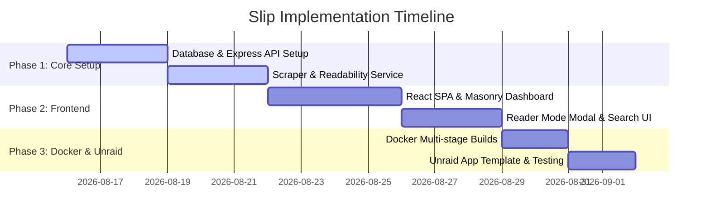

# Product Requirements Document (PRD): Slip

## 1. Overview & Vision

**Slip** is a self-hosted, visual bookmarking application designed to act as a private "second brain" for your digital life. Inspired by the philosophy of "purposeful disorganization" (like mymind), Slip aims to eliminate the mental friction of managing bookmarks by automatically parsing content, extracting metadata, and indexing text for effortless search.

The application is tailored for self-hosters and home-lab enthusiasts, specifically designed to run efficiently inside a Docker container on Unraid servers with minimal resource usage.

### Core Philosophy
*   **No File Cabinets:** Users should not waste time organizing items into nested folder hierarchies.
*   **Visual First:** Bookmarks should be displayed as rich, recognizable visual cards, not just lists of text.
*   **Privacy Centric:** 100% self-hosted; all metadata, images, and user data remain on the user's hardware.
*   **Lightweight & Fast:** The system must run efficiently with a small memory and CPU footprint on home server hardware.

---

## 2. User Personas & Scenarios

### Persona: Marcus, the Self-Hoster / Home-Lab Enthusiast
Marcus runs an Unraid server at home. He is privacy-conscious and dislikes SaaS subscriptions. He wants a bookmark manager that he can spin up via a Docker template in the Unraid Community Apps store, point to a local SQLite database, and share with his family.

### Persona: Sarah, the Creative Researcher
Sarah finds articles, recipe links, visual assets, and products all day. She wants a quick way to "throw" a URL into a inbox using a browser extension and search it later using simple keywords (e.g., "baking," "design layout") without manually labeling everything beforehand.

---

## 3. Key Objectives & Scope

### In-Scope (MVP)
*   **Single-User / Multi-User Support:** Simple local login with secure password hashing.
*   **Frictionless Content Capture (Easily Accessible):**
    *   Web UI button to add a link or markdown note.
    *   Authenticated API endpoints for browser extensions, iOS Shortcuts, and third-party webhooks.
    *   Draggable Browser Bookmarklet (one-click browser saving without extensions).
    *   PWA Web Share Target (allows sharing directly from mobile apps like Chrome, Safari, and Twitter).
*   **Automatic Metadata Extraction (Scraper):**
    *   Retrieve webpage titles, descriptions, and favicons.
    *   Extract open-graph preview images and download them locally to prevent hotlinking.
*   **Smart Cards Grid:** A modern, responsive masonry or grid-based frontend displaying saved bookmarks as card objects.
*   **Shareables (Public Links):** Allow users to generate secure, shareable public URLs for individual bookmarks or filtered tag views.
*   **Distraction-Free Reader Mode:** Strip ads, scripts, and navigation to save a clean markdown/HTML copy of articles.
*   **Full-Text Search:** High-performance search over titles, descriptions, tags, and cached article bodies.
*   **Dockerization:** Multi-stage build support for `amd64` and `arm64`, configuring persistence through volume mounts.

### Out-of-Scope (Future Phases)
*   **OCR (Optical Character Recognition):** Parsing text from images (e.g., using Tesseract).
*   **Local AI Auto-Tagging:** Using local LLMs (via Ollama integration) to categorize cards.
*   **Multi-tenant Organization Spaces:** Shared workspaces for groups (the MVP focuses on personal/family instances with private user accounts).
*   **Native iOS/Android Apps:** The Web UI will be fully responsive and installable as a Progressive Web App (PWA) instead.

---

## 4. Functional Requirements

### 4.1. Capture & Scraping
*   **FR-1.1:** Users can save any URL.
*   **FR-1.2:** The backend must fetch the URL in the background, parse Open Graph / Twitter card tags, and fallback to parsing the page's `<title>` and `<meta name="description">`.
*   **FR-1.3:** The backend must extract the primary image from the page, download it, resize it (thumbnail generation), and save it to the local cache directory.
*   **FR-1.4:** If the URL points to an article, the scraper must extract clean body text using a readability algorithm and store it for indexing.
*   **FR-1.5:** Scraping tasks must run asynchronously or with a non-blocking timeout (max 10 seconds) to ensure the client request does not hang.
*   **FR-1.6 (Data Portability):** Support bookmark importing from standard Netscape HTML formats and bookmark exporting to JSON/HTML format.
*   **FR-1.7 (Job Queue & Rate Limiting):** Scraping jobs must run in a rate-limited queue (e.g., max 2 concurrent scrapers) to prevent container crash or remote server bans.
*   **FR-1.8 (Bookmarklet):** Provide a draggable JavaScript bookmarklet for single-click bookmarking on any desktop or mobile browser.
*   **FR-1.9 (PWA Web Share Target):** Configure the Web UI as an installable Progressive Web App (PWA) that registers as a native Share Target in iOS/Android share sheets.
*   **FR-1.10 (API Key Authentication):** Support generating static personal API keys for headless API calls (e.g., curl scripts, iOS Shortcuts) bypassing cookie-based login checks securely.

### 4.2. Visual Dashboard (Frontend)
*   **FR-2.1:** A clean, grid/masonry dashboard layout representing cards.
*   **FR-2.2:** Each card must display:
    *   Preview thumbnail image (or a placeholder with a unique colored background if no image is found).
    *   Favicon and domain name.
    *   Title and short snippet/description.
    *   Date added.
*   **FR-2.3:** Card Details View: Clicking a card opens a modal overlay displaying:
    *   Original link.
    *   Full parsed description.
    *   Editable notes/tags.
    *   "Reader Mode" viewer for articles.
    *   Action to delete the bookmark.
*   **FR-2.4:** Fully responsive layout adapting dynamically to mobile, tablet, and desktop screens.
*   **FR-2.5 (Shareable Link Generator):** Users can toggle public sharing on a bookmark. The system generates a unique, cryptographically random, tokenized read-only link (e.g., `/shared/b/<token>`) that unauthenticated users can access.
*   **FR-2.6 (Tag Collections Sharing):** Users can toggle sharing for a specific tag. The system generates a tokenized link (e.g., `/shared/t/<token>`) displaying a grid of bookmarks associated with that tag.
*   **FR-2.7 (Dynamic Smart Card Layouts):** Cards are structured and styled uniquely depending on their `content_type` (e.g., article cards showcase reading times and title hierarchy, images feature borderless image-dominant previews, products display price tags, videos overlay a play action indicator).
*   **FR-2.8 (Auto-Categorization Filter Bar):** A minimalist filter bar at the top of the interface allowing users to instantly segment links by auto-extracted types: All, Articles, Images, Products, Videos, and Websites.
*   **FR-2.9 (Visual Aesthetics & Polish):** Interface must use curated HSL color schemes, modern sans-serif typography, large tracking/letter-spacing adjustments for headers, smooth transition micro-animations on hover states, and completely eliminate standard visual clichés (e.g., no harsh borders, no glow accents).

### 4.3. Search & Organization
*   **FR-3.1:** A unified search bar at the top of the interface.
*   **FR-3.2:** Search queries must match terms in the bookmark title, description, tags, domain name, or article body text.
*   **FR-3.3:** Users can manually add tags to any card.
*   **FR-3.4:** Clicking a tag filters the dashboard view to display only cards containing that tag.

### 4.5. User Management & Authentication
*   **FR-4.1:** Local authentication system (username/password).
*   **FR-4.2:** Support for initial setup flow (creating the first administrator account).
*   **FR-4.3:** Admin panel to invite/create additional users (each user has a completely isolated bookmark collection).

---

## 5. Non-Functional & Security Requirements

### 5.1. Performance & Hosting
*   **NFR-1.1:** The entire Docker container must run comfortably with `< 100MB` RAM at idle.
*   **NFR-1.2:** Page loads and search requests must complete in under 200ms.
*   **NFR-1.3:** SQLite database file and cached assets must be persistent across container restarts/rebuilds.
*   **NFR-1.4 (SQLite Reliability & Backups):** The database must operate in WAL (Write-Ahead Logging) mode with synchronous = NORMAL to prevent writes from blocking reads. Automatic optimizations (e.g. VACUUM, ANALYZE) must run monthly, and lock-free backups generated using safe database snapshots (`VACUUM INTO`).
*   **NFR-1.5 (UID/GID Permissions):** The Docker image must respect host-defined `PUID` and `PGID` environment variables for correct file mapping on Unraid servers.
*   **NFR-1.6 (Log Management):** Standard output logging must be clean and rate-limited to avoid bloated Docker console logs filling Unraid hosts' log partitions.

### 5.2. Security Guidelines (Mandatory)
*   **SEC-2.1 (Passwords):** All user passwords must be hashed using `bcrypt` (or `argon2id`) with a unique salt. Plaintext passwords must never be stored.
*   **SEC-2.2 (Sessions):** Authentication sessions must be maintained via secure, server-signed cookies (`HttpOnly`, `Secure` when on HTTPS, `SameSite=Lax`). Session IDs must be cryptographically random.
*   **SEC-2.3 (CSRF):** Implemented CSRF protection for all state-changing API endpoints (POST, PUT, DELETE) using a double-submit cookie or custom header validation.
*   **SEC-2.4 (XSS Prevention):**
    *   All user input rendered in JSX must utilize framework-native escaping.
    *   Reader Mode content scraped from the web is untrusted HTML and **must** be sanitized on the backend/frontend using `DOMPurify` before rendering.
*   **SEC-2.5 (SQL Injection):** All database interactions must use parameterized queries or an established ORM. String concatenation for SQL queries is strictly forbidden.
*   **SEC-2.6 (Path Traversal):** Image caching and file storage paths must be strictly sanitized using `path.basename()` to prevent users from requesting files outside the designated cache sandbox.
*   **SEC-2.7 (CORS):** Limit CORS requests to trusted domains (such as browser extensions under specific origin configurations) to prevent unauthorized sites from calling API endpoints.

---

## 6. Release & Implementation Phases

### Phase 1: Backend & Scraper (MVP)
*   Configure Node.js + Express API project in TypeScript.
*   Setup SQLite database with migrations.
*   Implement scraper service using `axios`/`got` and a readability parser.
*   Write API tests verifying scraping reliability and database writes.

### Phase 2: Frontend & UX
*   Initialize Vite + React SPA.
*   Build clean, modern visual grid styling using Vanilla CSS.
*   Integrate full-text search bar and tag filtering.
*   Implement secure Auth cookies and login screens.

### Phase 3: Dockerization & Unraid Hosting
*   Create optimized Dockerfile utilizing a node-alpine base image.
*   Verify volume mappings for database `/data/slip.db` and thumbnails `/data/cache`.
*   Create XML template documentation for Unraid Community Apps directory.
